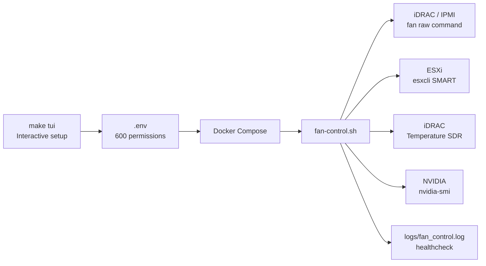
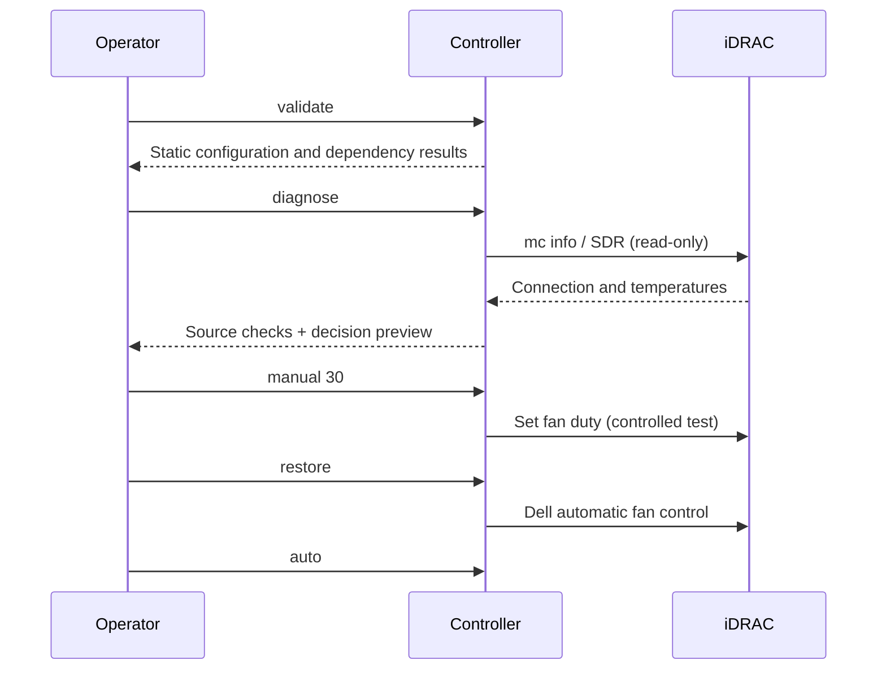
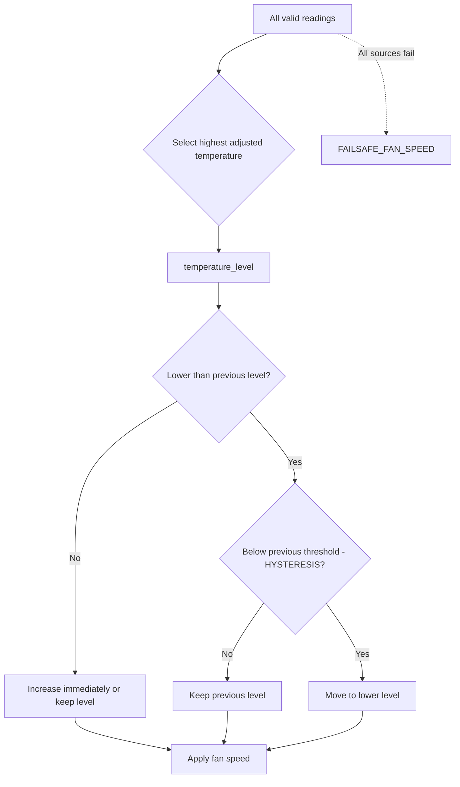

# iDRAC Fan Speed Control

**English** | [繁體中文](README.zh-TW.md)

[](#testing-and-quality-gates)
[](https://github.com/DF-wu/iDRACFanSpeedControl/pkgs/container/idrac-fan-control)
[](LICENSE)

A fan controller for Dell PowerEdge servers. It sets the fan duty cycle through iDRAC IPMI OEM raw commands, then selects a fan-curve level using one or more temperature sources: ESXi NVMe SMART, iDRAC temperature sensors, or NVIDIA GPUs.

> [!CAUTION]
> This program temporarily overrides Dell's automatic fan control. During initial setup, keep the iDRAC Web UI or a physical console available. Verify `manual`, `restore`, and `diagnose` before running `auto` for an extended period. If the server overheats, readings become unreliable, or behavior is abnormal, run `restore` immediately and stop the container.

## How it works



The controller sends fan commands only to iDRAC; all temperature sources are read-only. When multiple sources are enabled, it uses the highest valid decision temperature. The GPU reading is adjusted by `GPU_TEMP_OFFSET` first, preventing the GPU package temperature from driving chassis fans unnecessarily fast.


*Figure 1: Enabling IPMI over LAN in the iDRAC Web UI. The exact option name may vary by iDRAC firmware version.*

## Quick start: safe first-time setup with the TUI

Run the setup on the Docker host. The TUI requires no `dialog`, Python, or other additional packages. It is written in pure Bash, preserves comments from `.env.example`, updates files atomically, and sets file permissions to `600`.

```bash
git clone https://github.com/DF-wu/iDRACFanSpeedControl.git
cd iDRACFanSpeedControl
make tui
```

The main menu looks like this. Each submenu writes changes back to `.env`, and the file location is shown again when you exit.

```text
╭────────────────────────────────────────────────────────────╮
│              iDRAC Fan Control · Setup TUI                │
╰────────────────────────────────────────────────────────────╯

  1) Quick setup wizard       6) Safety, timing, and logging
  2) iDRAC / IPMI settings    7) Review redacted configuration
  3) Temperature source       8) Validate configuration
  4) ESXi NVMe source         9) Run read-only diagnostics
  5) Fan curve                0) Save and exit
```

For your first setup, select `iDRAC sensors only` and leave ESXi and GPU sources disabled. After completing the TUI, run:

```bash
make validate
docker compose run --rm idrac-fan-control diagnose
docker compose up -d
docker logs -f idrac-fan-control
```

`diagnose` is read-only and never sends fan raw commands. It checks iDRAC, every temperature source, the writable log path, and previews the fan level that would be selected. If you do not need a source, remove it from the TUI source preset instead of ignoring its errors.

To edit a different configuration file:

```bash
src/fan-control-tui.sh --config /path/to/staging.env
```

### Create `.env` manually

```bash
cp .env.example .env
chmod 600 .env
$EDITOR .env
```

Minimal iDRAC-only example:

```dotenv
IDRAC_IP=192.0.2.10
IDRAC_ID=root
IDRAC_PASSWORD=change-me
OPERATION_MODE=auto
TEMPERATURE_SOURCES=idrac
```

Replace `IDRAC_PASSWORD`, the IP address, and the management network with real values. Values such as `192.0.2.*`, `change-me`, and `replace_with_*` in `.env.example` are intentional placeholders and will be rejected by `validate`.

## Command reference

| Command | Purpose | Changes fan control |
| --- | --- | --- |
| `auto` | Continuously controls fans from the configured curve and restores automatic mode on exit when configured | Yes |
| `once` | Reads temperatures once, applies one decision, and exits | Yes |
| `manual 35` | Sets a 35% duty cycle; without a number, uses `MANUAL_FAN_SPEED` | Yes |
| `restore` | Sends the Dell automatic fan-control command | Yes (restore) |
| `status` | Shows chassis status and raw temperature SDR data | No |
| `config` | Shows the effective configuration; passwords are shown only as set/length | No |
| `validate` | Checks values, placeholders, required commands, and source conditions | No |
| `diagnose` | Probes connections and temperature readings and shows a decision preview | No |
| `healthcheck` | Checks configuration and whether the auto-control log was updated recently enough | No |

With Docker Compose:

```bash
docker compose run --rm idrac-fan-control config
docker compose run --rm idrac-fan-control validate
docker compose run --rm idrac-fan-control diagnose
docker compose run --rm idrac-fan-control status
docker compose run --rm idrac-fan-control once
docker compose run --rm idrac-fan-control manual 35
docker compose run --rm idrac-fan-control restore
```

The local script accepts the same commands:

```bash
src/FanControlWithEsxiSmart.sh diagnose
src/FanControlWithEsxiSmart.sh config
```

Local execution requires `bash`, `coreutils`, `ipmitool`, and `timeout`. ESXi password authentication also requires `sshpass`. The Docker image includes these dependencies.

## Safe startup sequence



Before unattended operation, confirm each item:

1. IPMI over LAN is enabled in the iDRAC Web UI and the management network is reachable.
2. The iDRAC account has the required permissions and its password is not a placeholder.
3. `manual 30` sets a low speed, `manual 70` sets a conservative speed, and `restore` returns control to Dell automatic mode.
4. Every enabled source reports `[PASS]` in `diagnose`; disable sources you do not use.
5. Start with a conservative `FAILSAFE_FAN_SPEED` and `RESTORE_AUTO_ON_EXIT=true`.

## Temperature sources and control decisions

`TEMPERATURE_SOURCES` is a comma-separated list containing `esxi`, `idrac`, and/or `gpu`. Sources can be combined, and the controller retains each source label for logging and diagnostics.

| Source | Reading | Requirements | Behavior on failure |
| --- | --- | --- | --- |
| `idrac` | Readable sensors from `ipmitool sdr type Temperature` | iDRAC IPMI | Marks this source as failed |
| `esxi` | `esxcli storage core device smart get` for the configured NVMe device | SSH and `DRIVE_DEVICE` | Marks this source as failed |
| `gpu` | Temperature of each GPU reported by `nvidia-smi` | NVIDIA Container Toolkit and driver | Marks this source as failed |



The default curve is shown below. `validate` ensures that thresholds are strictly increasing, fan speeds never decrease, and the fail-safe speed is not lower than the critical speed.

| Level | Decision temperature | Default fan speed |
| --- | --- | --- |
| `idle` | `<65°C` | 25% |
| `low` | `65–69°C` | 30% |
| `medium` | `70–74°C` | 40% |
| `high` | `75–79°C` | 50% |
| `critical` | `>=80°C` | 60% |
| `failsafe` | All sources fail | 70% |

Moving to a lower fan level requires the temperature to fall by `HYSTERESIS` degrees below the relevant threshold, preventing repeated speed changes near a boundary. Moving to a higher level is immediate. The adjusted GPU value is `GPU_TEMP - GPU_TEMP_OFFSET`, with a minimum of 0°C.

## Configuration reference

### Connection and operating mode

| Variable | Default | Description |
| --- | --- | --- |
| `IDRAC_IP` | Empty | iDRAC hostname or IP; required for all fan commands |
| `IDRAC_ID` | `root` | iDRAC user |
| `IDRAC_PASSWORD` | Empty | Passed to `ipmitool -E` through the `IPMI_PASSWORD` environment variable; never appears in argv |
| `IPMI_INTERFACE` | `lanplus` | Usually left unchanged |
| `IPMI_TIMEOUT` / `IPMI_RETRIES` | `5` / `2` | Per-command timeout and retry count |
| `OPERATION_MODE` | `manual` | `auto`, `once`, or `manual` |
| `DRY_RUN` | `false` | Only for testing command construction; does not produce real readings |
| `COMMAND_TIMEOUT` | `20` | Maximum duration in seconds for SSH, IPMI, and GPU commands |
| `CHECK_INTERVAL` | `60` | Seconds between cycles in auto mode |
| `RESTORE_AUTO_ON_EXIT` | `true` | Restores automatic control when auto mode receives SIGTERM or exits |

### Temperature sources

| Variable | Default | Description |
| --- | --- | --- |
| `TEMPERATURE_SOURCES` | `esxi` | Comma-separated list of `esxi,idrac,gpu` |
| `WITH_GPU_TEMP` | `false` | Legacy compatibility switch; `true` appends `gpu` |
| `GPU_TEMP_OFFSET` | `15` | Offset subtracted from GPU temperature |
| `ESXI_HOST` / `ESXI_USERNAME` | Empty / `root` | ESXi SSH target |
| `ESXI_PASSWORD` | Empty | Used when no key is configured; never echoed by the TUI |
| `ESXI_SSH_KEY` | Empty | Preferred over password authentication when set |
| `ESXI_SSH_PORT` | `22` | SSH port (1–65535) |
| `SSH_CONNECT_TIMEOUT` | `10` | SSH connection timeout in seconds |
| `SSH_STRICT_HOST_KEY_CHECKING` | `accept-new` | `yes`, `no`, `ask`, or `accept-new` |
| `DRIVE_DEVICE` | Empty | Full ID returned by `esxcli storage core device list` |
| `IDRAC_SENSOR_INCLUDE_REGEX` | Empty | awk regex used to keep matching sensor names only |
| `IDRAC_SENSOR_EXCLUDE_REGEX` | `no reading\|disabled\|not readable` | Excludes invalid SDR entries |

### Fan curve, safety, and diagnostics

| Variable | Default | Description |
| --- | --- | --- |
| `TEMP_LOW/MEDIUM/HIGH/CRITICAL` | `65/70/75/80` | Strictly increasing thresholds in °C |
| `FAN_SPEED_IDLE/LOW/MEDIUM/HIGH/CRITICAL` | `25/30/40/50/60` | Values from 1–100% that must not decrease |
| `HYSTERESIS` | `2` | Degrees below the previous threshold required before lowering fan speed |
| `FAILSAFE_ON_ERROR` | `true` | Uses a conservative speed when all sources fail |
| `FAILSAFE_FAN_SPEED` | `70` | Must be greater than or equal to the critical speed |
| `MANUAL_FAN_SPEED` | `35` | Used by `manual` when no argument is provided |
| `LOG_DIR` / `LOG_FILE` | `/var/log/fan-control` / `fan_control.log` | Persistent state log |
| `LOG_LEVEL` | `INFO` | `DEBUG` adds command and source details but never logs passwords |
| `HEALTHCHECK_MAX_AGE` | `0` | `0` means `CHECK_INTERVAL*3 + COMMAND_TIMEOUT` |

## Docker deployment and GPU support

The Compose configuration uses the GHCR image, host networking, and a `./logs` volume by default:

```bash
docker compose pull
docker compose up -d
docker compose ps
docker inspect --format '{{.State.Health.Status}}' idrac-fan-control
```

The `healthcheck` verifies more than environment configuration. In `OPERATION_MODE=auto`, it also confirms that `fan_control.log` has been updated within `HEALTHCHECK_MAX_AGE`. If every data source fails while `FAILSAFE_ON_ERROR=false`, the control cycle does not write a success record and the container becomes unhealthy. This is an intentional safety signal.

GPU mode requires the NVIDIA Container Toolkit. Uncomment `gpus: all` in `docker-compose.yml`, then configure:

```dotenv
TEMPERATURE_SOURCES=idrac,gpu
GPU_TEMP_OFFSET=15
```

Verify the setup:

```bash
docker run --rm --gpus all nvidia/cuda:12.9.0-runtime-ubuntu24.04 nvidia-smi
docker compose run --rm idrac-fan-control diagnose
```

If GPU support is unnecessary, build locally without CUDA to reduce the image size:

```bash
docker build --build-arg BASE_IMAGE=ubuntu:24.04 -t idrac-fan-control:local .
```

## Debugging, logs, and troubleshooting

Example normal log entry:

```text
2026-07-18 03:12:10 [INFO] Control temp 68C -> low (30%). Sources: idrac:Inlet Temp=68C
```

For additional context, temporarily set:

```dotenv
LOG_LEVEL=DEBUG
```

Then inspect:

```bash
docker logs -f idrac-fan-control
tail -f logs/fan_control.log
docker compose run --rm idrac-fan-control diagnose
```

`DEBUG` logs targets, command types, source selection, and failure stages only. Passwords never appear in argv or the configuration summary. See [docs/TROUBLESHOOTING.md](docs/TROUBLESHOOTING.md) for the complete symptom → check → fix table, and [USAGE_GUIDE.md](USAGE_GUIDE.md) for routine and emergency operations.

Shortest recovery path for common problems:

```bash
# Restore Dell automatic control first whenever risk is uncertain
docker compose run --rm idrac-fan-control restore

# Inspect the effective configuration and dependency state
docker compose run --rm idrac-fan-control config
docker compose run --rm idrac-fan-control diagnose
```

## Security and backups

- Never commit `.env`, `logs/`, private keys, or incident dumps. The TUI sets configuration file permissions to `600`.
- Compose mounts the gitignored `./secrets` directory read-only at `/run/secrets`. Use the in-container path for ESXi keys, such as `/run/secrets/esxi_ed25519`.
- Prefer `ESXI_SSH_KEY`. When password authentication is required, the controller uses the `SSHPASS` environment variable with `sshpass -e`, keeping the password out of argv.
- The iDRAC password is supplied through the `IPMI_PASSWORD` environment variable and `ipmitool -E`. The `config` command and TUI review show only whether it is set and its character count.
- Keep iDRAC and ESXi on an isolated management network. Never expose IPMI over LAN to the public internet.
- Before changing `.env`, keep an offline backup with `600` permissions and test `restore`.

## Finding the ESXi drive identifier

```bash
ssh root@ESXI_HOST
esxcli storage core device list
esxcli storage core device smart get -d 't10.NVMe____full_identifier_string'
```

Copy the complete identifier into `DRIVE_DEVICE`; do not shorten it. If the SMART output does not include a numeric `Drive Temperature`, `diagnose` marks the ESXi source as failed instead of silently treating the error as 0°C.

## Testing and quality gates

```bash
make test             # bash -n + 37 core assertions + 10 TUI assertions
make validate         # Check the current .env with Docker dependencies; does not change fans
make validate-example # DRY_RUN smoke test that does not require .env
make docker-build
```

Tests cover source normalization, SDR parsing, GPU offset, hysteresis, fail-safe behavior, curve/port/regex validation, credential redaction, health freshness, diagnostic previews, and safe round-tripping of TUI configuration files. Real hardware, ESXi SSH, and GPUs must still be verified with `diagnose` on your management network.

## Project structure

```text
.
├── src/
│   ├── FanControlWithEsxiSmart.sh   # Controller, validate, diagnose, and healthcheck
│   ├── fan-control-tui.sh           # Pure Bash setup TUI
│   └── setIdracFanSpeed.sh          # Compatibility wrapper for the legacy script
├── tests/
│   ├── fan-control.test.sh          # Core logic and safety tests
│   └── tui.test.sh                  # .env parser/writer tests
├── docs/
│   └── TROUBLESHOOTING.md           # Symptom-based troubleshooting guide
├── images/image.png                 # iDRAC IPMI settings screenshot
├── .env.example                     # Fully commented configuration template
├── docker-compose.yml
├── Dockerfile
├── Makefile
├── README.md                        # English documentation
├── README.zh-TW.md                  # Traditional Chinese documentation
└── USAGE_GUIDE.md
```

## Compatibility and limitations

The project primarily targets Dell PowerEdge R730/R730xd-class systems with iDRAC 8 OEM fan raw commands. Other generations may be compatible, but identical behavior must not be assumed. Complete `manual`, `restore`, and `diagnose` checks before unattended operation. Actual iDRAC, ESXi, and GPU sensor names and permissions vary by firmware and driver, so rely on diagnostic output from your own environment.

## License

MIT. See [LICENSE](LICENSE).

Documentation last reviewed: July 18, 2026.
