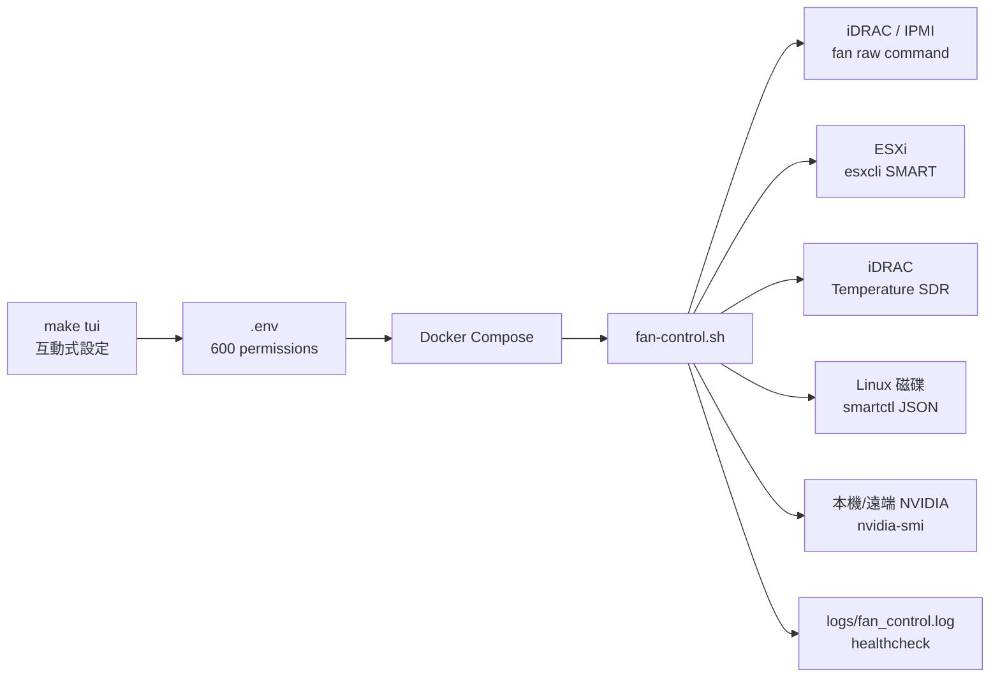
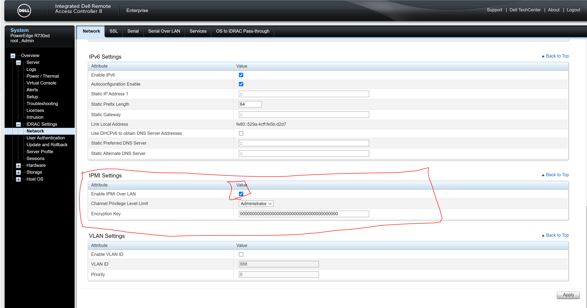
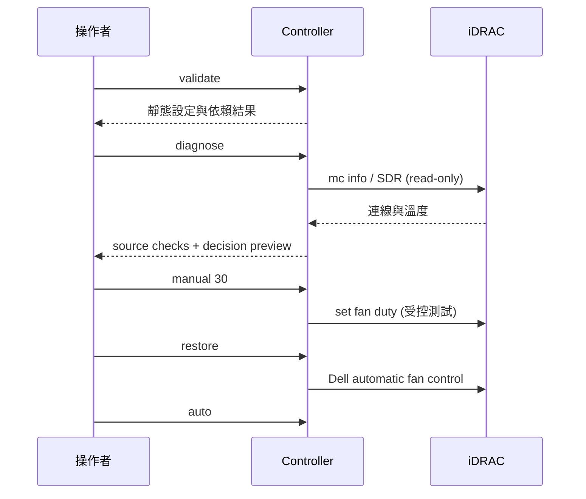
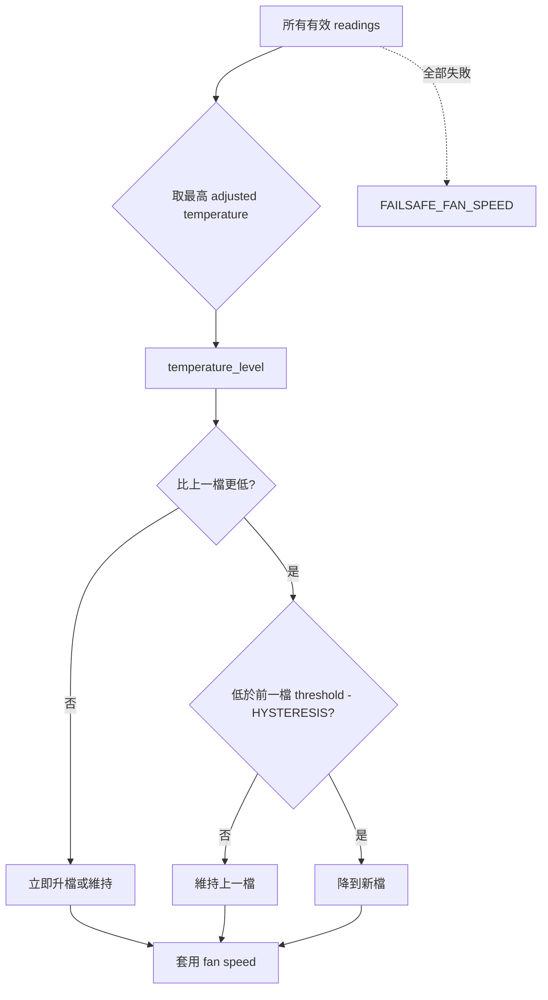

# iDRAC Fan Speed Control

[English](README.md) | **繁體中文**

[](#測試與品質門檻)
[](https://github.com/DF-wu/iDRACFanSpeedControl/pkgs/container/idrac-fan-control)
[](LICENSE)

這是一個給 Dell PowerEdge 使用的風扇控制器。它透過 iDRAC 的 IPMI OEM raw command 設定 fan duty cycle，再以可插拔溫度來源決定風扇曲線：ESXi NVMe SMART、iDRAC sensor、本機 Linux 磁碟，以及本機或遠端 NVIDIA GPU。

> [!CAUTION]
> 這個程式會暫時覆寫 Dell 原廠風扇控制。第一次設定請保留 iDRAC Web UI 或實體主控台，先用 `manual`、`restore`、`diagnose` 驗證，再讓 `auto` 長時間執行。任何過熱、讀值不可信或行為異常時，立即執行 `restore` 並停止容器。

## 先看懂它如何工作



控制器只會對 iDRAC 發送風扇命令；溫度來源全部是讀取。每個 provider 都實作同一組 `validate`、`collect`、`adjust` 介面。多來源時採用最高的有效 adjusted temperature；GPU 與磁碟可各自套用 offset，不需在決策流程加入來源特例。



*圖 1：在 iDRAC Web UI 開啟 IPMI over LAN；實際選項名稱會依 iDRAC 韌體版本略有不同。*

## 快速開始：用 TUI 完成安全的第一次設定

建議在 Docker 主機上操作。TUI 不需要 `dialog`、Python 或其他額外套件；它使用純 Bash，會保留 `.env.example` 的註解、以原子方式更新檔案，並將檔案權限設為 `600`。

```bash
git clone https://github.com/DF-wu/iDRACFanSpeedControl.git
cd iDRACFanSpeedControl
make tui
```

主畫面如下（每次進入子頁都會寫回 `.env`，離開時會再次顯示檔案位置）：

```text
╭────────────────────────────────────────────────────────────╮
│              iDRAC Fan Control · Setup TUI                │
╰────────────────────────────────────────────────────────────╯

  1) Quick setup wizard       6) Safety, timing, and logging
  2) iDRAC / IPMI settings    7) Review redacted configuration
  3) Temperature source       8) Safety, timing, and logging
  4) ESXi NVMe source         9) Review redacted configuration
  5) Local Linux disks       10) Validate configuration
  6) Remote NVIDIA GPUs      11) Run read-only diagnostics
  7) Fan curve                0) Save and exit
```

第一次建議選 `iDRAC sensors only`，先不要把外部來源加入決策。TUI 完成後，依序執行：

```bash
make validate
docker compose run --rm idrac-fan-control diagnose
docker compose up -d
docker logs -f idrac-fan-control
```

`diagnose` 是唯讀檢查，不會送出風扇 raw command。它會逐項顯示 iDRAC、每個溫度來源、可寫 log 路徑與「如果現在控制會選哪一檔」的 preview。若某個來源不用，從 TUI 的 source preset 移除它，而不是忽略錯誤後繼續運行。

若要編輯另一份設定檔：

```bash
src/fan-control-tui.sh --config /path/to/staging.env
```

### 手動建立 `.env`（不用 TUI 也可以）

```bash
cp .env.example .env
chmod 600 .env
$EDITOR .env
```

最小的 iDRAC-only 範例：

```dotenv
IDRAC_IP=192.0.2.10
IDRAC_ID=root
IDRAC_PASSWORD=change-me
OPERATION_MODE=auto
TEMPERATURE_SOURCES=idrac
```

先將 `IDRAC_PASSWORD`、IP 與管理網路換成真實值。`.env.example` 的 `192.0.2.*`、`change-me`、`replace_with_*` 都是故意放的 placeholder，`validate` 會拒絕它們。

## 命令速查

| 命令 | 作用 | 是否改變風扇 |
| --- | --- | --- |
| `auto` | 持續依曲線控制，離開時依設定還原自動模式 | 是 |
| `once` | 讀取一次並套用一個決策後離開 | 是 |
| `manual 35` | 設定 35% duty cycle；未帶數字時讀 `MANUAL_FAN_SPEED` | 是 |
| `restore` | 發送 Dell 自動風扇控制命令 | 是（還原） |
| `status` | 顯示 chassis 與原始 temperature SDR | 否 |
| `config` | 顯示有效設定摘要，密碼只顯示「set／長度」 | 否 |
| `validate` | 檢查數值、placeholder、依賴命令與來源條件 | 否 |
| `diagnose` | 逐項連線與溫度讀值探測，含決策 preview | 否 |
| `healthcheck` | 檢查設定與 auto 控制 log 是否在合理時間內更新 | 否 |

Docker Compose 用法：

```bash
docker compose run --rm idrac-fan-control config
docker compose run --rm idrac-fan-control validate
docker compose run --rm idrac-fan-control diagnose
docker compose run --rm idrac-fan-control status
docker compose run --rm idrac-fan-control once
docker compose run --rm idrac-fan-control manual 35
docker compose run --rm idrac-fan-control restore
```

本機腳本可直接使用相同命令：

```bash
src/FanControlWithEsxiSmart.sh diagnose
src/FanControlWithEsxiSmart.sh config
```

本機執行需要 `bash`、`coreutils`、`ipmitool`、`timeout`。Linux 磁碟模式另需 `smartctl` 與 `jq`；SSH password 模式另需 `sshpass`。Docker image 已包含這些依賴。

## 安全啟動順序



正式開始前逐項確認：

1. iDRAC Web UI 的 IPMI over LAN 已開啟，管理網路可達。
2. iDRAC 帳號具備必要權限，密碼不再是 placeholder。
3. `manual 30` 能設定低速，`manual 70` 能設定保守速度，`restore` 能回到 Dell 自動模式。
4. `diagnose` 的每一個已啟用來源都是 `[PASS]`；不用的來源請停用。
5. 先以較保守的 `FAILSAFE_FAN_SPEED` 和 `RESTORE_AUTO_ON_EXIT=true` 運行。

## 溫度來源與控制決策

`TEMPERATURE_SOURCES` 使用逗號分隔，可填 `esxi`、`idrac`、`gpu`、`linux_disk`、`remote_gpu`。來源可以混合；控制器會保留每個來源的 label 供 log 與診斷追蹤。擴充介面與部署範例請見 [Temperature source interface](docs/TEMPERATURE_SOURCES.md)。

| 來源 | 讀取內容 | 必要條件 | 失敗時的行為 |
| --- | --- | --- | --- |
| `idrac` | `ipmitool sdr type Temperature` 中可讀的 sensor | iDRAC IPMI | 該來源標記失敗 |
| `esxi` | 指定 NVMe 的 `esxcli storage core device smart get` | SSH、`DRIVE_DEVICE` | 該來源標記失敗 |
| `gpu` | 本機 `nvidia-smi` 的每張 GPU 溫度 | NVIDIA Container Toolkit／驅動 | 該來源標記失敗 |
| `linux_disk` | 每個指定 Linux device 的 SMART 溫度 | `smartctl`、`jq`、device 權限 | 單一磁碟失敗，保留其他有效讀值 |
| `remote_gpu` | 每台指定 VM 上 `nvidia-smi` 回報的所有 GPU | SSH 與遠端 NVIDIA driver | 單一 VM 失敗，保留其他有效讀值 |



預設曲線如下；`validate` 會確保 threshold 嚴格遞增、fan speed 不遞減，且 fail-safe 不低於 critical speed。

| Level | 決策溫度 | 預設風扇 |
| --- | --- | --- |
| `idle` | `<65°C` | 25% |
| `low` | `65–69°C` | 30% |
| `medium` | `70–74°C` | 40% |
| `high` | `75–79°C` | 50% |
| `critical` | `>=80°C` | 60% |
| `failsafe` | 所有來源失敗 | 70% |

降檔會等待 `HYSTERESIS` 度，避免溫度在閾值附近來回跳速；升檔不延遲。每個來源自行調整讀值：本機與遠端 GPU 分別扣除各自 offset，Linux 磁碟扣除 `LINUX_DISK_TEMP_OFFSET`，最低都不會小於 0°C。

## 設定參考

### 連線與模式

| 變數 | 預設 | 說明 |
| --- | --- | --- |
| `IDRAC_IP` | 空 | iDRAC hostname 或 IP；所有 fan 命令必要 |
| `IDRAC_ID` | `root` | iDRAC 使用者 |
| `IDRAC_PASSWORD` | 空 | 由 `IPMI_PASSWORD` environment 傳給 `ipmitool -E`，不出現在 argv |
| `IPMI_INTERFACE` | `lanplus` | 通常保持不變 |
| `IPMI_TIMEOUT` / `IPMI_RETRIES` | `5` / `2` | 單次 timeout 與 retry |
| `OPERATION_MODE` | `manual` | `auto`、`once`、`manual` |
| `DRY_RUN` | `false` | 只在測試命令組合時使用；不會產生真實讀值 |
| `COMMAND_TIMEOUT` | `20` | SSH、IPMI、GPU 外部命令上限（秒） |
| `CHECK_INTERVAL` | `60` | auto 每個 cycle 間隔（秒） |
| `RESTORE_AUTO_ON_EXIT` | `true` | auto 收到 SIGTERM／離開時還原 |

### 溫度來源

| 變數 | 預設 | 說明 |
| --- | --- | --- |
| `TEMPERATURE_SOURCES` | `esxi` | 已註冊 source ID 的逗號清單 |
| `WITH_GPU_TEMP` | `false` | 舊版相容開關；true 會附加 `gpu` |
| `GPU_TEMP_OFFSET` | `15` | GPU 溫度的補償度數 |
| `ESXI_HOST` / `ESXI_USERNAME` | 空 / `root` | ESXi SSH 目標 |
| `ESXI_PASSWORD` | 空 | 沒有 key 時使用；TUI 不會回顯 |
| `ESXI_SSH_KEY` | 空 | 設定後優先使用 key authentication |
| `ESXI_SSH_PORT` | `22` | SSH port（1–65535） |
| `SSH_CONNECT_TIMEOUT` | `10` | SSH 建立連線上限（秒） |
| `SSH_STRICT_HOST_KEY_CHECKING` | `accept-new` | `yes`、`no`、`ask` 或 `accept-new` |
| `DRIVE_DEVICE` | 空 | `esxcli storage core device list` 找到的完整 ID |
| `LINUX_DISK_DEVICES` | 空 | Linux device path 逗號清單，例如 `/dev/nvme1,/dev/sdb` |
| `LINUX_DISK_TEMP_OFFSET` | `0` | 從本機磁碟溫度扣除的 offset |
| `LINUX_DISK_NOCHECK` | `never` | smartctl power mode check；`standby` 可避免喚醒休眠磁碟 |
| `REMOTE_GPU_HOSTS` | 空 | Linux GPU VM hostname 或 IP 逗號清單 |
| `REMOTE_GPU_USERNAME` / `REMOTE_GPU_SSH_PORT` | `root` / `22` | 遠端 GPU 主機共用的 SSH identity |
| `REMOTE_GPU_PASSWORD` / `REMOTE_GPU_SSH_KEY` | 空 / 空 | 遠端 GPU SSH 認證；建議使用 key |
| `REMOTE_GPU_TEMP_OFFSET` | `15` | 從遠端 GPU 溫度扣除的 offset |
| `IDRAC_SENSOR_INCLUDE_REGEX` | 空 | 只保留符合 sensor 名稱的 awk regex |
| `IDRAC_SENSOR_EXCLUDE_REGEX` | `no reading\|disabled\|not readable` | 排除無效 SDR |

### 風扇曲線、安全與診斷

| 變數 | 預設 | 說明 |
| --- | --- | --- |
| `TEMP_LOW/MEDIUM/HIGH/CRITICAL` | `65/70/75/80` | 嚴格遞增的°C threshold |
| `FAN_SPEED_IDLE/LOW/MEDIUM/HIGH/CRITICAL` | `25/30/40/50/60` | 1–100%，不可遞減 |
| `HYSTERESIS` | `2` | 降檔所需低於前 threshold 的°C |
| `FAILSAFE_ON_ERROR` | `true` | 所有來源失敗時使用保守速度 |
| `FAILSAFE_FAN_SPEED` | `70` | 必須 >= critical speed |
| `MANUAL_FAN_SPEED` | `35` | `manual` 未帶參數時使用 |
| `LOG_DIR` / `LOG_FILE` | `/var/log/fan-control` / `fan_control.log` | 持久化狀態 log |
| `LOG_LEVEL` | `INFO` | `DEBUG` 會增加命令與來源細節，絕不列密碼 |
| `HEALTHCHECK_MAX_AGE` | `0` | 0 代表 `CHECK_INTERVAL*3 + COMMAND_TIMEOUT` |

## Docker 部署、Linux 磁碟與 GPU

Compose 預設使用 GHCR image、host network 與 `./logs` volume：

```bash
docker compose pull
docker compose up -d
docker compose ps
docker inspect --format '{{.State.Health.Status}}' idrac-fan-control
```

`healthcheck` 不只驗證 env；在 `OPERATION_MODE=auto` 時也會確認 `fan_control.log` 在 `HEALTHCHECK_MAX_AGE` 內更新。若資料來源全部失敗且 `FAILSAFE_ON_ERROR=false`，控制 cycle 不會寫成功紀錄，容器會變成 unhealthy，這是刻意的安全訊號。

GPU 模式需要 NVIDIA Container Toolkit。編輯 `docker-compose.yml`，取消 `gpus: all` 註解，再設定：

```dotenv
TEMPERATURE_SOURCES=idrac,gpu
GPU_TEMP_OFFSET=15
```

驗證：

```bash
docker run --rm --gpus all nvidia/cuda:12.9.0-runtime-ubuntu24.04 nvidia-smi
docker compose run --rm idrac-fan-control diagnose
```

若不需要 GPU，使用不含 CUDA 的本機 build 可降低 image 大小：

```bash
docker build --build-arg BASE_IMAGE=ubuntu:24.04 -t idrac-fan-control:local .
```

Linux 磁碟模式必須將 `LINUX_DISK_DEVICES` 的每個 device 映射進容器，例如：

```yaml
services:
  idrac-fan-control:
    devices:
      - /dev/nvme1:/dev/nvme1
```

若要在 TrueNAS 將 CD6 與其他 VM 的 NVIDIA GPU 納入同一決策鏈，設定 `TEMPERATURE_SOURCES=linux_disk,remote_gpu`、映射 CD6 controller device，並以唯讀 volume 掛載 GPU VM SSH key。完整範例請見 [docs/TEMPERATURE_SOURCES.md](docs/TEMPERATURE_SOURCES.md)。

## Debug、log 與故障排除

正常 log 範例：

```text
2026-07-18 03:12:10 [INFO] Control temp 68C -> low (30%). Sources: idrac:Inlet Temp=68C
```

需要更多上下文時暫時設定：

```dotenv
LOG_LEVEL=DEBUG
```

再觀察：

```bash
docker logs -f idrac-fan-control
tail -f logs/fan_control.log
docker compose run --rm idrac-fan-control diagnose
```

`DEBUG` 只會印目標、命令種類、來源選擇與失敗階段；密碼不會放在 argv，也不會寫入 config summary。完整的症狀→檢查→修復表請看 [docs/TROUBLESHOOTING.md](docs/TROUBLESHOOTING.md)。日常與緊急操作請看 [USAGE_GUIDE.md](USAGE_GUIDE.md)。

常見最短修復路徑：

```bash
# 任何不確定的風險先還原 Dell 自動控制
docker compose run --rm idrac-fan-control restore

# 看目前有效設定與依賴狀態
docker compose run --rm idrac-fan-control config
docker compose run --rm idrac-fan-control diagnose
```

## 安全與備份

- `.env`、`logs/`、私鑰與 incident dump 都不應提交到 Git；TUI 會將設定檔權限設為 `600`。
- Compose 會以 read-only 掛載 gitignored 的 `./secrets` 到 `/run/secrets`；請使用 `/run/secrets/esxi_ed25519` 或 `/run/secrets/gpu_vms_ed25519` 這類容器內路徑。
- 優先使用 `ESXI_SSH_KEY`；若必須用 password，控制器會以 `SSHPASS` environment 搭配 `sshpass -e`，不把密碼放進 argv。
- iDRAC 密碼透過 `IPMI_PASSWORD` environment 搭配 `ipmitool -E`；`config`／TUI review 只顯示 set 與字元數。
- iDRAC／ESXi 應位於隔離管理網路，避免把 IPMI over LAN 暴露到公網。
- 每次變更 `.env` 前保留一份 `chmod 600` 的離線備份，並測試 `restore`。

## 從哪裡取得 ESXi drive identifier

```bash
ssh root@ESXI_HOST
esxcli storage core device list
esxcli storage core device smart get -d 't10.NVMe____完整識別字串'
```

把完整 identifier 放到 `DRIVE_DEVICE`，不要自行縮短。若 SMART 輸出沒有 `Drive Temperature` 數值，`diagnose` 會將 ESXi source 標成 FAIL，而不會偷偷把錯誤當成 0°C。

## 測試與品質門檻

```bash
make test             # bash -n + 52 個核心 assertions + 14 個 TUI assertions
make validate         # 以 Docker 依賴檢查目前的 .env（不改變風扇）
make validate-example # 不需要 .env 的 DRY_RUN smoke test
make docker-build
```

測試涵蓋統一 source 介面、Linux SMART 收集、多主機 remote GPU、source offset、SDR parsing、hysteresis、fail-safe、設定驗證、credential redaction、health freshness、診斷 preview，以及 TUI 設定檔安全 round-trip。真實硬體、SSH target、磁碟、iDRAC 與 GPU 仍須在管理網路上以 `diagnose` 驗證。

## 專案結構

```text
.
├── src/
│   ├── FanControlWithEsxiSmart.sh   # 控制器、validate、diagnose、healthcheck
│   ├── fan-control-tui.sh           # 純 Bash 設定 TUI
│   └── setIdracFanSpeed.sh          # 舊腳本相容 wrapper
├── tests/
│   ├── fan-control.test.sh          # 核心邏輯與安全測試
│   └── tui.test.sh                  # .env parser / writer 測試
├── docs/
│   ├── TEMPERATURE_SOURCES.md        # Source 介面與部署範例
│   └── TROUBLESHOOTING.md           # 症狀導向除錯手冊
├── images/image.png                 # iDRAC IPMI 設定畫面
├── .env.example                     # 帶完整註解的設定模板
├── docker-compose.yml
├── Dockerfile
├── Makefile
├── README.md
├── README.zh-TW.md
└── USAGE_GUIDE.md
```

## 相容性與限制

專案以 Dell PowerEdge R730/R730xd、iDRAC 8 類機型的 OEM fan raw command 為主要驗證目標。其他世代可能相容，但不能假設相同；請在無人值守前完成 `manual`／`restore`／`diagnose`。Sensor 名稱、磁碟權限、SSH access 與 driver 行為會依環境改變，應以實際 diagnostic output 為準。

## 授權

MIT，詳見 [LICENSE](LICENSE)。

文件最後檢視：2026-08-15。
