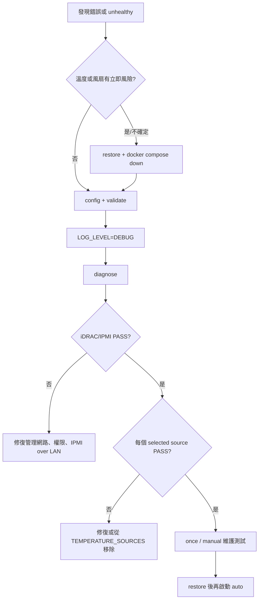

# iDRAC Fan Control 故障排除手冊

這份手冊以症狀為入口。任何可能涉及過熱或未知 fan state 的問題，第一步都不是重啟，而是把控制交還 Dell：

```bash
docker compose run --rm idrac-fan-control restore
docker compose down
```

## 標準診斷流程



先收集不含明文密碼的證據：

```bash
docker compose run --rm idrac-fan-control config
docker compose run --rm idrac-fan-control validate
docker compose run --rm idrac-fan-control diagnose
docker compose ps
docker logs --tail 200 idrac-fan-control
tail -n 200 logs/fan_control.log
```

需要命令階段與來源選擇細節時，在 `.env` 設 `LOG_LEVEL=DEBUG` 後重跑 `diagnose`。Debug log 不會列出 iDRAC、ESXi 或 remote GPU 密碼；提交 issue 前仍應檢查主機名稱、IP、device identifier 是否需要遮罩。

## Diagnostic output 怎麼讀

成功範例：

```text
iDRAC Fan Control diagnostics (read-only)
[PASS] configuration        static validation passed
[PASS] log path             /var/log/fan-control
[PASS] iDRAC/IPMI           2.60, PowerEdge R730xd
[PASS] source:idrac         Inlet Temp=24C, Exhaust Temp=39C
[PASS] source:esxi          t10.NVMe...=46C
[PASS] decision preview     46C -> idle (25%), no command sent

Result: PASS - controller dependencies are ready.
```

`source:*` 只要有一個選取來源失敗，diagnose 就回傳非零，即使另一來源仍可讀。這是為了讓「降級運行」變得可觀測；auto 實際決策仍會使用剩餘的有效 readings，只有全部失敗才進 fail-safe。

## 症狀對照表

| 症狀／訊息 | 最可能原因 | 確認方式 | 修復 |
| --- | --- | --- | --- |
| `Missing required configuration: IDRAC_IP` | `.env` 未填或 TUI 未完成 | `... config` | `make tui` 填入真實 target |
| `Replace placeholder value` | 還在用 `change-me`、`192.0.2.*` 類模板值 | `... config` | 換成環境實值 |
| `Required command not found: ipmitool` | 直接在 host 跑但未安裝依賴 | `command -v ipmitool` | 用 Docker，或安裝 ipmitool/coreutils |
| `iDRAC/IPMI ... failed` | IPMI over LAN 關閉、網路 ACL、帳密／權限錯 | `ipmitool ... mc info` | 修復 iDRAC 設定與管理網路 |
| `source:idrac ... no valid` | SDR 無 readable temperature 或 regex 過濾全部 | `status`、清空 include regex | 修正 filter；保留預設 exclude |
| `source:esxi ... no valid` | SSH、device ID 或 SMART 格式錯 | ESXi 上直接跑 `esxcli ... smart get` | 修復 key/password、port、完整 ID |
| `source:gpu ... no valid` | 容器無 GPU、驅動／Toolkit 未配置 | `docker ... nvidia-smi` | 啟用 `gpus: all` 與 Toolkit，或移除 gpu source |
| `source:linux_disk ... no valid` | device 未映射、權限不足、SMART 無溫度 | host 與容器內分別執行 `smartctl -A -j` | 加入精確 `devices` mapping，確認 `jq` 與路徑 |
| `source:remote_gpu ... no valid` | VM 不可達、SSH 認證或遠端 `nvidia-smi` 失敗 | 以相同 key 手動 SSH 執行 query | 修復 host/key/known_hosts/driver，或移除失敗 target |
| `No valid temperature readings` | 所有 selected sources 都失敗 | `diagnose` | 修復至少一個 source；先保留 fail-safe |
| `Fail-safe fan speed applied` | 上述全部失敗且 fail-safe 開啟 | 同時看前面的 source WARN | 修復來源；這不是曲線 level |
| `Fan speeds must not decrease` | 高溫檔位比低溫檔位低 | TUI Review | 讓 idle ≤ low ≤ medium ≤ high ≤ critical |
| `FAILSAFE_FAN_SPEED must be at least...` | fail-safe 比 critical 還低 | `validate` | 提高 fail-safe 或調整曲線 |
| `Healthcheck control loop is stale` | auto cycle 不再寫 log、volume 或來源失敗 | `healthcheck`、`docker logs` | 修正 cycle 錯誤／volume，不要只提高 max age |
| 容器反覆 restart | 主程序啟動 validation 失敗 | `docker compose logs` | 修正 `.env` 後再 up |
| 關閉容器後仍是 manual fan | restore 指令失敗或容器被強制終止 | 直接執行 `restore` | 確認 iDRAC 可達並從 Web UI 檢查 |

## iDRAC / IPMI 深入檢查

控制器使用 `IPMI_PASSWORD` environment 搭配 `ipmitool -E`，密碼不會出現在 process argv。手動測試時也建議使用相同方式：

```bash
read -rs IPMI_PASSWORD
export IPMI_PASSWORD
ipmitool -I lanplus -H "$IDRAC_IP" -U "$IDRAC_ID" -E mc info
ipmitool -I lanplus -H "$IDRAC_IP" -U "$IDRAC_ID" -E sdr type Temperature
unset IPMI_PASSWORD
```

檢查項目：

1. iDRAC Web UI 的 IPMI over LAN 已開啟。
2. host 到 iDRAC 的 UDP 623 未被 ACL／firewall 擋住。
3. 帳號不是只有 read-only 權限。
4. `IPMI_INTERFACE=lanplus` 適合該 iDRAC 世代。
5. timeout 才發生時，可小幅增加 `IPMI_TIMEOUT` 與 `IPMI_RETRIES`，但先排除網路品質。

如果 `mc info` 成功但 OEM raw fan command 失敗，機型或 firmware 可能不支援這組 Dell command。不要假設其他 PowerEdge 世代一定相容。

## iDRAC sensor filtering

先看原始輸出：

```bash
docker compose run --rm idrac-fan-control status
```

預設排除 `no reading|disabled|not readable`。若只想採用特定 sensor，可設定 awk regular expression：

```dotenv
IDRAC_SENSOR_INCLUDE_REGEX=^(Inlet Temp|Exhaust Temp|CPU[12] Temp)$
```

注意 sensor 名稱大小寫由 iDRAC 決定；include regex 套用在 sensor name，exclude regex 套用在轉成小寫的整行。`validate` 會拒絕語法不合法的 regex，但無法預先知道它是否會過濾掉所有實際 sensor，因此仍須跑 `diagnose`。

## ESXi NVMe 深入檢查

```bash
ssh -p 22 root@ESXI_HOST
esxcli storage core device list
esxcli storage core device smart get -d '完整 DRIVE_DEVICE'
```

控制器預期輸出含 `Drive Temperature` 與整數。若裝置只提供其他欄位、輸出語系／格式不同，parser 會安全地回報失敗，不會猜測溫度。SSH key 模式下確認：

```bash
chmod 600 /path/to/key
ssh -i /path/to/key -o BatchMode=yes root@ESXI_HOST true
```

容器要使用 host key file 時，還必須把 key 以 read-only volume 掛進 container，且 `.env` 的 `ESXI_SSH_KEY` 要填 container 內路徑；只填 host path 不會自動掛載。

## Linux 磁碟深入檢查

先在 host 上執行與控制器相同的唯讀查詢：

```bash
sudo smartctl -A -j /dev/nvme1 | jq '.temperature.current // .nvme_smart_health_information_log.temperature'
```

再確認容器看到同一個 device：

```bash
docker compose run --rm --entrypoint sh idrac-fan-control -c \
  'ls -l /dev/nvme1 && smartctl -A -j /dev/nvme1 | jq .temperature'
```

Host 成功、容器失敗通常代表 `docker-compose.yml` 未加入 `/dev/nvme1:/dev/nvme1`。`LINUX_DISK_DEVICES` 必須是 `/dev/...` 逗號清單；控制器會拒絕空白、shell metacharacter、相對路徑，以及含 `.`、`..` 或空元件的路徑。smartctl 的非零狀態可能是 SMART health bitmask，因此只要 JSON 仍含有效溫度，控制器會保留該讀值；timeout、無效 JSON 或沒有溫度才使該 device 失敗。

## NVIDIA GPU 深入檢查

```bash
nvidia-smi
docker run --rm --gpus all nvidia/cuda:12.9.0-runtime-ubuntu24.04 nvidia-smi
docker compose run --rm idrac-fan-control diagnose
```

第一個失敗代表主機驅動問題；第一個成功、第二個失敗通常是 Container Toolkit；兩者成功但 Compose 失敗則檢查 `docker-compose.yml` 的 `gpus: all`。不用 GPU 做控制時，最安全的修復是從 `TEMPERATURE_SOURCES` 移除 `gpu`，而不是把錯誤隱藏。

遠端 GPU 來源請從 controller host 或容器測試完全相同的命令：

```bash
ssh -i /run/secrets/gpu_vms_ed25519 monitor@gpu-vm-1 \
  'nvidia-smi --query-gpu=index,temperature.gpu --format=csv,noheader,nounits'
```

若互動式 SSH 成功但 controller 失敗，檢查 key 的容器內路徑、`REMOTE_GPU_USERNAME`、port 與 `SSH_STRICT_HOST_KEY_CHECKING`。遠端登入 shell 必須能在非互動 `PATH` 找到 `nvidia-smi`。

## Healthcheck 與 log

auto mode 每次成功決策或套用 fail-safe 都會更新 `${LOG_DIR}/${LOG_FILE}`。預設允許的最大年齡為：

```text
CHECK_INTERVAL * 3 + COMMAND_TIMEOUT
```

`HEALTHCHECK_MAX_AGE=0` 代表使用上述公式。只有在外部監控有明確 cadence 需求時才固定正整數；把值設得很大會掩蓋停止更新的控制迴圈。

檢查 host volume：

```bash
ls -ld logs
ls -l logs/fan_control.log
docker inspect idrac-fan-control --format '{{json .Mounts}}'
```

專案不自動 rotate log。可用 host logrotate，例如針對 repository 的 `logs/fan_control.log` 設定 weekly rotation；不要在 container 裡安裝 cron，因為 container 重建後不會保留。

## 收集 issue 資訊

請附上：

- Server model 與 iDRAC major version（不要附 service tag）。
- `config` 輸出。
- `diagnose` 與最近 100 行 container log。
- 使用的 `TEMPERATURE_SOURCES`。
- 問題發生前的變更。
- `make test` 結果。

請勿附上 `.env`、密碼、SSH private key、公開可達的管理 IP 或完整 service tag。

文件最後檢視：2026-08-15。
